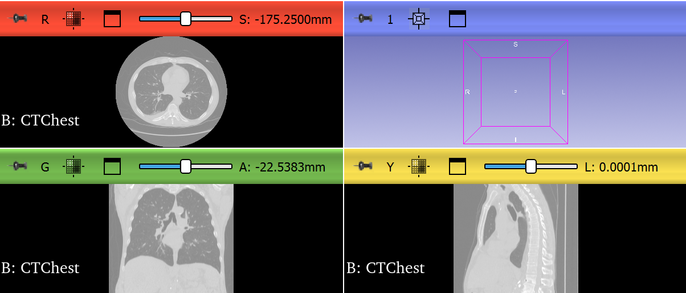
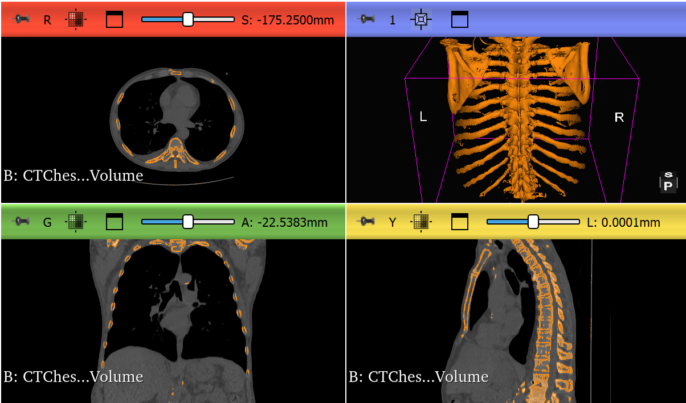
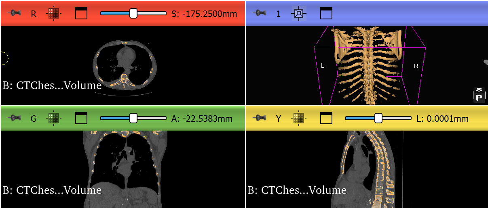
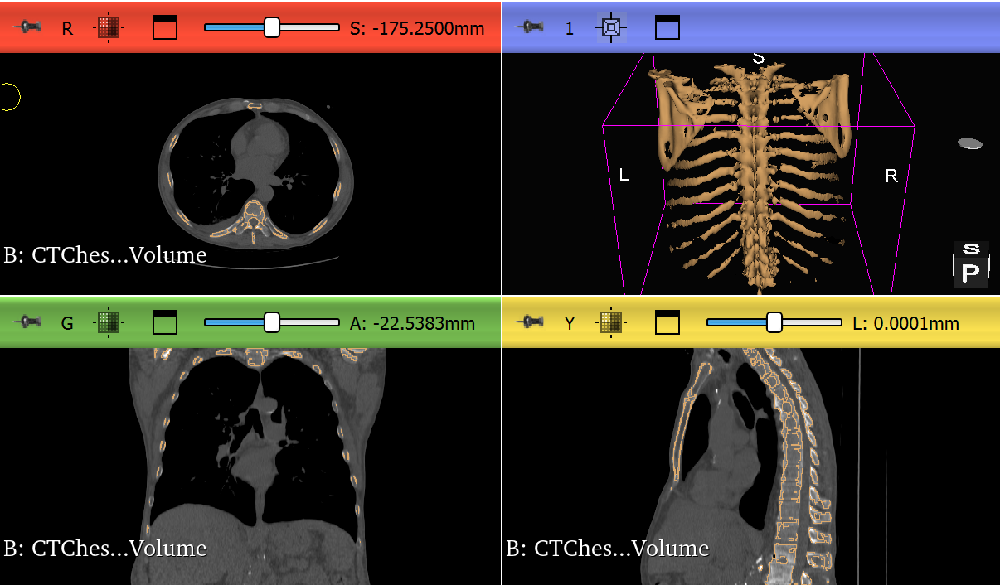

# CT Chest Bone Segmentation and 3D Reconstruction Using 3D Slicer

## Project Overview

This project demonstrates a medical imaging workflow using 3D Slicer. I used the CTChest sample dataset to isolate bone structures from a chest CT scan, clean the segmentation, generate a 3D model, and export files suitable for portfolio presentation.

The project shows practical skills in medical image annotation and AI training data preparation. It includes original CT visualization, threshold-based bone selection, segmentation cleanup, final 3D reconstruction, model exports, and workflow documentation.

## Dataset

- Dataset: CTChest sample data
- Source: Built-in 3D Slicer sample dataset
- Data type: CT volume
- Private patient data used: No

## Tools Used

- 3D Slicer
- Segment Editor
- Threshold effect
- Islands cleanup
- Smoothing effect
- 3D visualization
- Model export

## Workflow

1. Loaded the CTChest sample dataset in 3D Slicer.
2. Reviewed the CT scan in axial, sagittal, coronal, and 3D views.
3. Captured the original CT scan before segmentation.
4. Created a bone segmentation using threshold-based selection.
5. Reviewed the threshold selection across multiple views.
6. Removed small disconnected regions from the segmentation.
7. Applied smoothing to improve the segmentation surface.
8. Generated a final 3D bone model.
9. Exported the model in STL, OBJ, and PLY formats.
10. Documented the process with screenshots and workflow notes.

## Screenshots

### 1. Original CT Scan Before Segmentation

### 2. Threshold Selection Showing Highlighted Bone

### 3. Cleaned Bone Segmentation

### 4. Final 3D Bone Model

## Exported Files

models/
- CTChest_Final_Bone_Model.stl
- CTChest_Final_Bone_Model.obj
- CTChest_Final_Bone_Model.ply

segmentations/
- CTChest_Cleaned_Bone_Segmentation.seg.nrrd

scene/
- CTChest_Bone_Segmentation_Project.mrml

## AI Training Relevance

This project connects to AI training because medical imaging models often need labeled data for supervised learning and validation. A segmentation mask can act as a reference label for training, testing, or evaluating AI-generated outputs. This workflow shows how a human annotator can create, review, clean, and export structured medical image annotations.

## What This Project Shows

- I can work with CT medical imaging data in 3D Slicer.
- I can identify and segment high-density bone structures.
- I can review segmentation results in multiple anatomical planes.
- I can clean segmentation artifacts.
- I can generate a 3D anatomical model from CT data.
- I can export model files in common 3D formats.
- I can document a technical workflow clearly.
